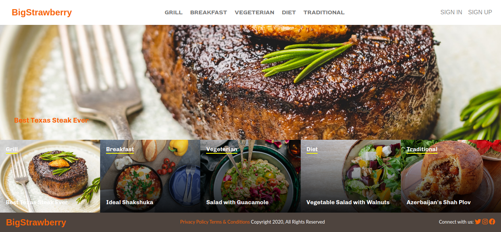

# BigStrawberry

 This project is about building a fully functional web application using Ruby on Rails framework. The idea of the web app is to provide a useful and entertaining platform for discovering, sharing, and voting great cooking recipes. The recipes grouped by categories and can be created, edited, and deleted by the author. In the homepage, you can see:
- The featured post on the first row, taking the full width. The featured post is the recipe with the biggest number of votes given by users.
- The categories of the meals on the navbar and under the featured post. Categories link to the page of recipes according to category.

The authentication system is very simple and only requires `Username` credentials. Users can create an article by clicking the `Add New Recipe` button on the home page. She can see the list of articles created by herself by clicking on the `Username` link which is at the rightmost side of the navbar. The articles can be edited and deleted by the author using icons under the recipes. You can vote for the recipes and help to move it to the featured banner.

## Built With

Tools:
- Ruby v2.7.1
- Ruby on Rails v6.0.3.2
- Cloudinary
- Pixlr
- Firefox Developer Edition

Gems:
- CarrierWave
- Cloudinary
- Figaro
- RSpec

Design:
- Nelson Sakwa's LifeStyle Articles design


## Screenshot



## Getting Started

To get a copy clone this repo to your local environment:

`git clone https://github.com/8Bts/Big_Strawberry'

## Prerequisites
In order to make the program work, you need to have ruby interpreter installed in your system. You can get the latest version of ruby from [official website](https://www.ruby-lang.org/en/downloads/).
Ruby works better on the linux OS but you can use other systems using bridging tools.


## Setup

Instal gems with:

```
bundle install
```

Setup database with:

```
   rails db:migrate
```


## Usage

Start server with:

```
    rails server
```

Open `http://localhost:3000/` in your browser.


## Tesing

Testing can be run using `rspec` command. Make sure you run `bundle` command before this.


## Authors
👤 **Rashid Mammadli**

- Github: [8Bts](https://github.com/8Bts)
- Twitter: [@Rasheed49705929](https://twitter.com/Rasheed49705929)
- Linkedin: [linkedin](https://www.linkedin.com/in/rashidmammadli/)
- Email: mcmizze@yahoo.com


## 🤝 Contributing


Contributions, issues and feature requests are welcome!

Feel free to check the <a href="https://github.com/8Bts/Big_Strawberry/issues" target="_blank">issues page</a>.

## Show your support

Give a ⭐️ if you like this project!

## Acknowledgments
- [Ruby Docs](https://apidock.com/)
- [Rails Guides](https://guides.rubyonrails.org/)
- [Cloudinary Docs](https://cloudinary.com/documentation/cloudinary_get_started)
- [LifeStyle articles by Nelson Sakwa](https://www.behance.net/gallery/14554909/liFEsTlye-Mobile-version)

